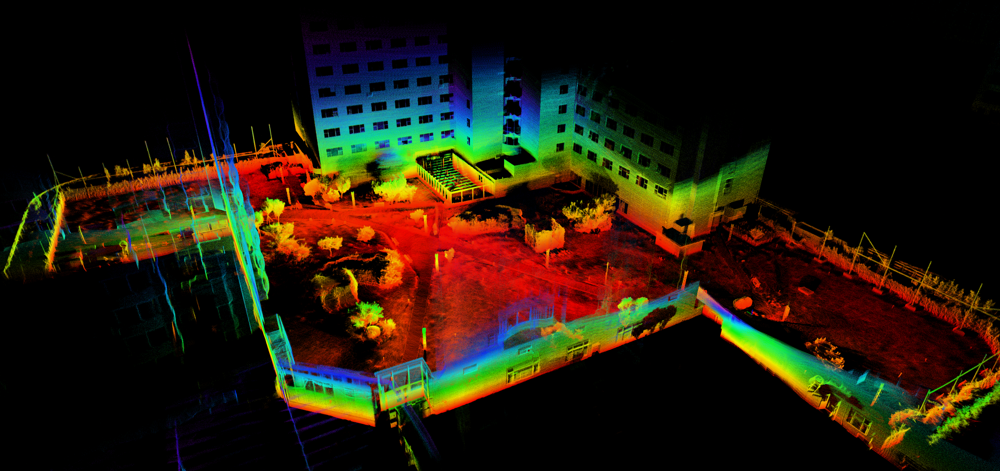
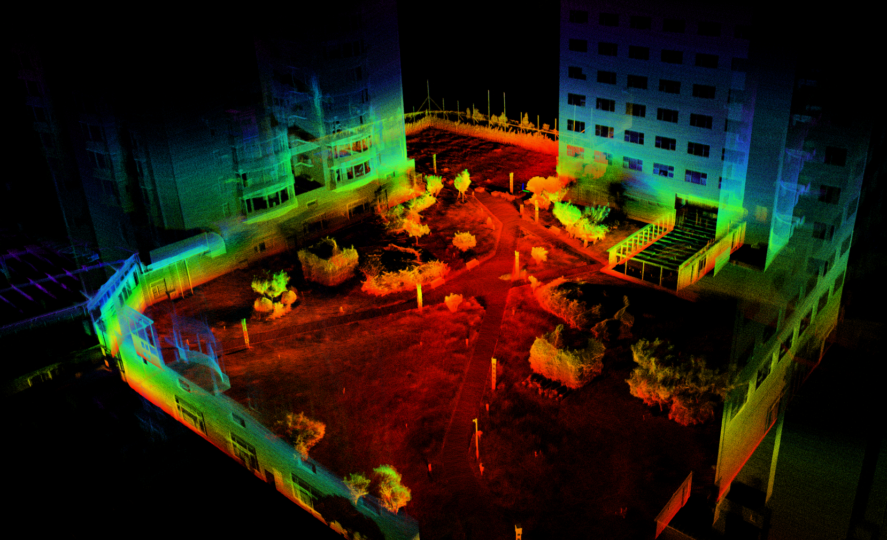
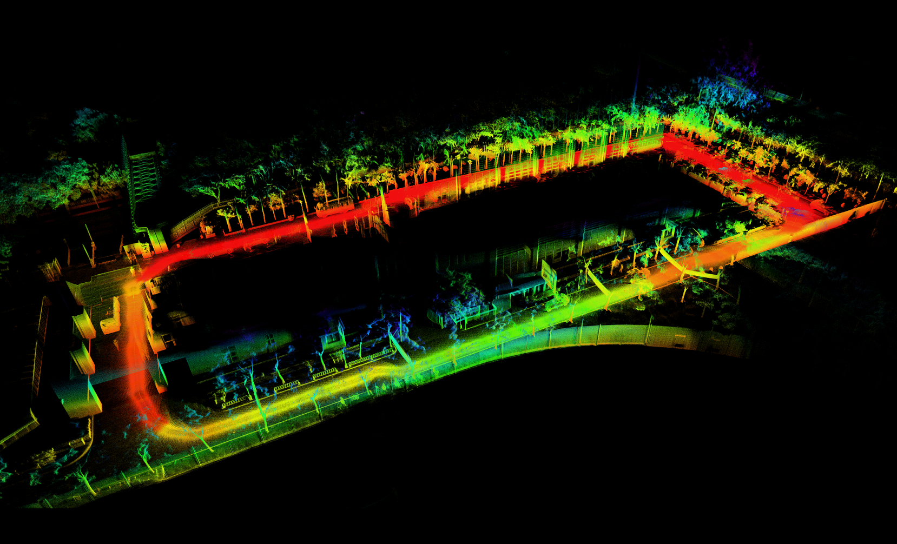
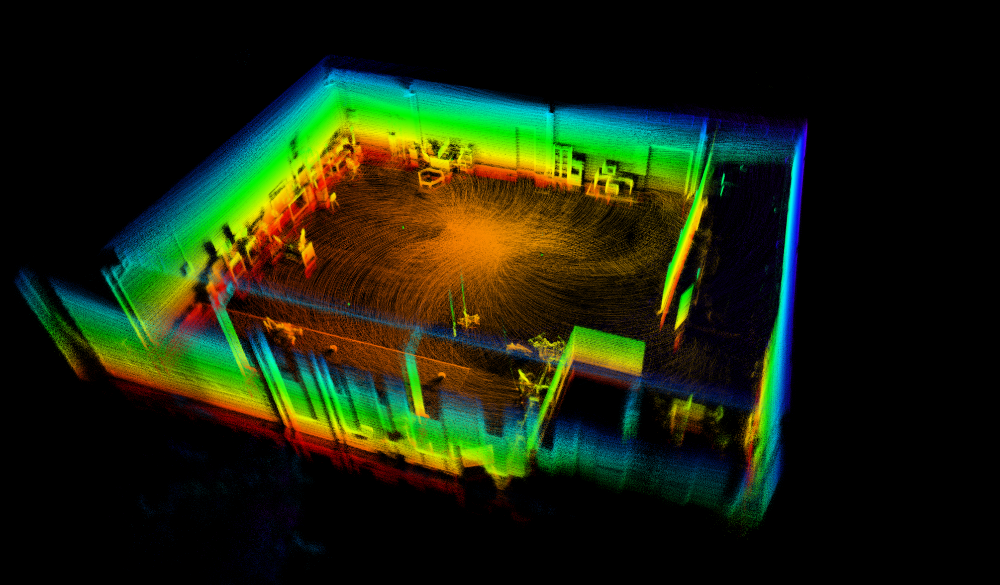
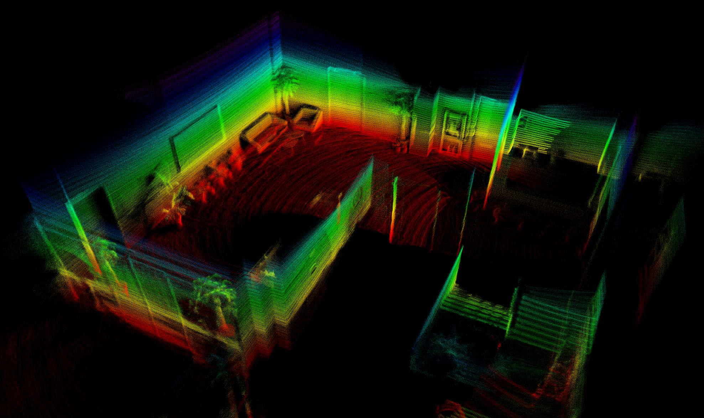
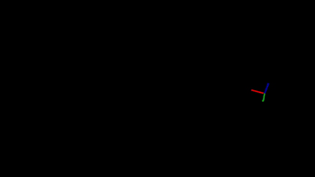

# S-FAST_LIO
## Simplified Implementation of FAST_LIO

S-FAST_LIO is a simplified implementation of FAST_LIO (Xu, Wei, et al. "Fast-lio2: Fast direct lidar-inertial odometry."), which is modified from [FAST_LIO](https://github.com/hku-mars/FAST_LIO). This code is clean and accessible. It is a reference material for SLAM beginners.The main modifications are as follows:
* The [Sophus](https://github.com/strasdat/Sophus) is used to define the state variables, instead of the complicated [IKFOM](https://github.com/hku-mars/IKFoM)
* The gravity component is directly defined by a Vector3d, thus the complicated calculation of two-dimensional manifold can be omitted
* The code structure has been optimized, and the unnecessary codes have been deleted
* Detailed Chinese notes are added to the code
* Add relocation function in established maps
* Support for Robosense LiDAR has been added

 In addition, the following links are also my previous works. I strongly recommend reading them, since they are the interpretation and detailed equation derivation of the FAST-LIO paper:

[FAST-LIO论文解读与详细公式推导(知乎)](https://zhuanlan.zhihu.com/p/587500859)

[FAST-LIO论文解读与详细公式推导(CSDN)](https://blog.csdn.net/weixin_44923488/article/details/128103159)


<div align=center>

</div>

## 1. Prerequisites
### 1.1 **Ubuntu** and **ROS**
Ubuntu >= 16.04.

### 1.2. **PCL && Eigen**
PCL >= 1.8, Eigen >= 3.3.4.

### 1.3. **livox_ros_driver**
Follow [livox_ros_driver Installation](https://github.com/Livox-SDK/livox_ros_driver).

Source：Add the line ``` source $Licox_ros_driver_dir$/devel/setup.bash ``` to the end of file ``` ~/.bashrc ```, where ``` $Licox_ros_driver_dir$ ``` is the directory of the livox ros driver workspace (should be the ``` ws_livox ``` directory if you completely followed the livox official document).

### 1.4. **Sophus**
We use the old version of Sophus
```
git clone https://github.com/strasdat/Sophus.git
cd Sophus
git checkout a621ff
mkdir build
cd build
cmake ../ -DUSE_BASIC_LOGGING=ON
make
sudo make install
```


## 2. Build S-FAST_LIO
Clone the repository and catkin_make:

```
cd ~/catkin_ws/src
git clone https://github.com/zlwang7/S-FAST_LIO.git
cd ../
catkin_make
source ~/catkin_ws/devel/setup.bash
```

## 3. Rosbag Example
### 3.1 Livox Avia Rosbag
Here we provide some additional Avia Rosbags. They are collected by [Arafat-ninja](https://github.com/Arafat-ninja).

<div align="left">




Files: Can be downloaded from [google drive](https://drive.google.com/drive/folders/1EqNt6Bm_6Jf3beRf_RI3yrhiUCND09se?usp=share_link).
You can also directly use the Avia Rosbags provided by FAST_LIO [(google drive)](https://drive.google.com/drive/folders/1YL5MQVYgAM8oAWUm7e3OGXZBPKkanmY1?usp=sharing).

Run:
```
roslaunch sfast_lio mapping_avia.launch
rosbag play YOUR_DOWNLOADED.bag
```

### 3.2  RS-LiDAR Rosbag
Datasets are collected by a RS-Helios LiDAR and an Xsens IMU.

<div align="left">





Files: Can be downloaded from [google drive](https://drive.google.com/drive/folders/1EqNt6Bm_6Jf3beRf_RI3yrhiUCND09se?usp=share_link).

Run:
```
roslaunch sfast_lio mapping_rs.launch
rosbag play YOUR_DOWNLOADED.bag
```

 ## 4. Relocalization
 It can relocalization in an established map. First, establish the map and note that *pcd_save_en* is set to true in the yaml file. Then, set the initial position and quaternion in yaml for relocalization, and run:
```
roslaunch sfast_lio mapping_rs_relocalization.launch
rosbag play YOUR_DOWNLOADED.bag
```

## 5. Directly Run
The same as [FAST_LIO](https://github.com/hku-mars/FAST_LIO).


## 6. Performance Comparison
Here we use the dataset (The Main Building in the University of
Hong Kong) in FAST-LIO paper.
The sensor suite is handheld during the data
collection and returned to the starting position after traveling
around 140m. The average number of effective feature points is 2015. All algorithms are tested on an Intel i7 2.3 GHz processor-based computer.


Performance Comparison|Average processing time|Drift|
:--:|:--:|:--:|
FAST-LIO|7.52ms|0.035%|
S-FAST_LIO|7.07ms|0.037%|


## 7. Acknowledgements
Thanks for the authors of [FAST-LIO](https://github.com/hku-mars/FAST_LIO).


